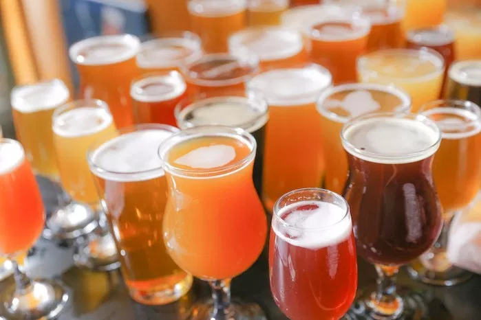

# "I was performing analysis of craft beers <i>before</i> it was cool" - Using NLP to find the best features of various styles of beers

Personal project using NLP and predictive models to provide insights into key features of beer

All beer information and reviews taken from [Beer Advocate](www.beeradvocate.com)

### Executive Summary

With the current popularity of the craft beers, it's difficult for indepdendant breweries to stand out. As such, this project aimed to provide independent breweries with the key features that beer drinkers look for in a good beer, through Natural Language Processing and predictive modelling
